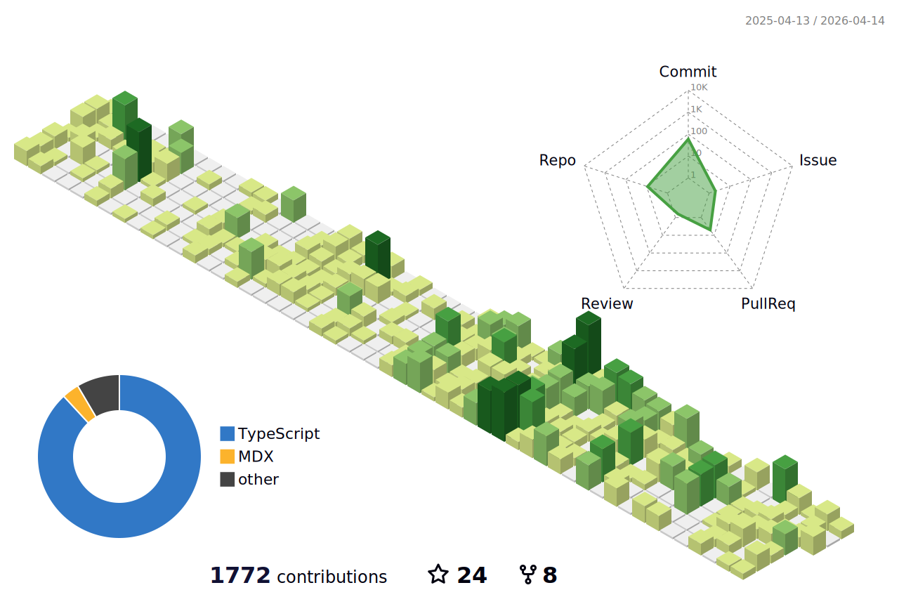

  <h1>Hi there, I'm Cris! 👋</h1>
  

    <strong>Full Stack Engineer</strong>, I'm currently exploring cutting-edge AI applications, focusing on <strong>LLM Agents</strong>.
  

  
  

 

## 🛠 Tech Stack

### 💻 Web Front-end

  
  
  
  
   
  
  
  

### 🗄️ Web Back-end & Blockchain

  
  
  
  
  
  

### 🤖 AI & LLM Stack

  
  
  
  

---

## 📈 Developer Metrics

  <picture>
    <source media="(prefers-color-scheme: dark)" srcset="./profile-3d-contrib/profile-night-green.svg">
    <source media="(prefers-color-scheme: light)" srcset="./profile-3d-contrib/profile-green-animate.svg">
    
  </picture>

  

    <i>"Code is like humor. When you have to explain it, it’s bad."</i>
  

